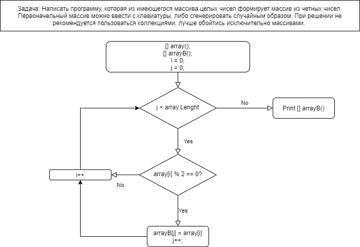

# Итоговая проверочная работа
Данная работа необходима для проверки ваших знаний и навыков по итогу прохождения первого блока обучения на программе разработчик. Мы должны убедиться что базовое знакомство с it прошло успешно.

Задача алгоритмически не самая сложная, однако для полценного выполнения проверочной работы необходимо:

Создать репозиторий на GitHub Нарисовать блок-схему алгоритма (можно обойтись блок-схемой основной содержательной части, если вы выделяете ее в отдельный метод) Снабдить репозиторий оформленным текстовым описанием решения (файл README.md) Написать программу, решающую поставленную задачу Использовать контроль версий в работе над этим небольшим проектом (не должно быть так что все залито одним коммитом, как минимум этапы 2, 3 и 4 должны быть расположены в разных коммитах) Задача: Написать программу, которая из имеющегося массива целых чисел формирует массив из четных чисел. Первоначальный массив можно ввести с клавиатуры, либо сгенерировать случайным образом. При решении не рекомендуется пользоваться коллекциями, лучше обойтись исключительно массивами.

## Примеры:

["Hello", "2", "world" , ":-)"] -> ["2" ":-)"] 
["1234", "1567", "-2", "computer science"] -> ["-2" ] 
["Russia", "Denmark", "Kazan" ] -> []

# Решение

Пишем метод создания нашего начального массива

CreateArray - название метода count - количество чисел в массиве Далее заполняем его, в нашем случае, радномными числами от 10 до 100, с помощью метода FillArray.

FillArray - название метода заполнения массива Метод типа void, который принимает наш первоначальный массив, минимальное и макимальное значение диапозона, откуда рандомно выберит значения для нашего массива. Метод void ничего не возвращает. Создаем метод печати массива

PrintArray название метода, подготавливает для вывода на экран наш первоначальный массива. Метод принимает наш массив, выводит на экран все числа по порядку их индексов. А теперь нам нужно написать метод, который выберет из нашего массива только чётные числа и соберет их в новый маасив.

EvenNumbers - название метода. с помощью цикла внутри метода, проверяем каждое число массива на четность, деля его на 2 и определяя остаток, если остаток равен 0, то число чётное. Чётное число добавляем в наш новый массив. Если число нечётное, то есть при делении на 2, остаток от деления не равен 0, то число не лобавляем в новый массив а переходим к спроверке следующего числа. Выше мы перечислили все методы для решения задачи. Теперь нам нужно вызвать все методы и получить результат.

int[] array = CreateArray(10); создаем массив из 10 значений

FillArray(array,10,100); заполняем массив рандомными числами от 10 до 100.

Console.WriteLine(PrintArray(array)); печатаем начальный массив

Console.WriteLine(PrintArray(EvenNumbers(array))); печатаем массив на основе первого, но только слстоящий из чётных числа